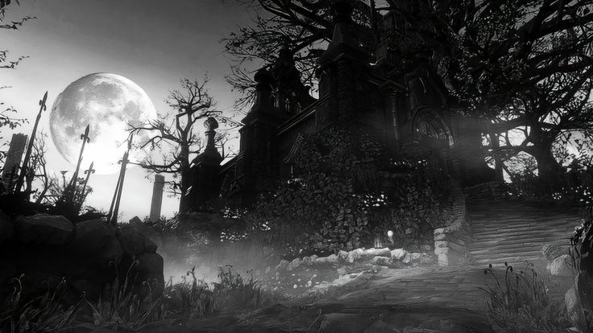
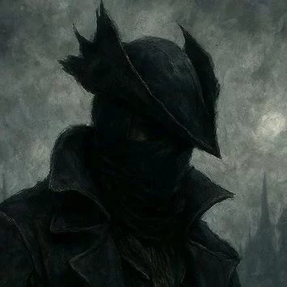

<!-- ════════════════════════════════════════════════════════════════════════
     "Fear the old blood. Yet do not forget — a Hunter must hunt."
                                              — Master Willem, of Byrgenwerth
     ════════════════════════════════════════════════════════════════════════ -->

<!-- BANNER -->
<div align="center">
  
</div>

<br/>

<!-- TITLE -->
<div align="center">
  
</div>

<br/>

<!-- CONTACT SIGILS -->
<div align="center">

[](https://www.linkedin.com/in/filipe-colla)
[](mailto:filipe10colla@gmail.com)
[](https://www.instagram.com/fi.colla/)
[](https://x.com/CollaFilipe)
[](https://github.com/collafilipe)

</div>

<br/>

<div align="center">


[](https://github.com/collafilipe)

</div>

<div align="center">

`✠ ─────── ⛧ ─────── ✠`

</div>

## ✦ Prayer at the Dream's Threshold

> *"We are born of the blood, made men by the blood, undone by the blood.*  
> *Our eyes are yet to open... Fear the old blood."*



I am **Filipe Colla**, a software developer wandering the moonlit cobblestones of *Yharnam* in pursuit of code that transcends mortal bounds. Each function is a sigil etched in ichor; each commit, a vow whispered to the Great Ones beyond the veil. I forge solutions from logic and old blood — slaying the beasts of complexity that crawl through forgotten systems and ancient legacies.

The Hunt is endless. The night, *eternal*. And yet — the dream still calls.

```
◈  Class        →  Software Developer · Full-Stack Hunter
◈  Origin       →  Brazil  ✟  Realm of the Pthumerian Sun
◈  Covenant     →  The Hunters of the Code
◈  Build        →  INT / LOGIC  ⊹  Arcane scaling
◈  Status       →  Awake. Refuses to go hollow.
```

<br clear="right"/>

<div align="center">

`✠ ─────── ⛧ ─────── ✠`

</div>

## ⚔ Arsenal of the Hunt

> *"A trick weapon, forged from the blood of countless trials."*

<div align="center">


</div>

<div align="center">

`✠ ─────── ⛧ ─────── ✠`

</div>

## 📜 Hunter's Logbook

<div align="center">


</div>

<div align="center">

`✠ ─────── ⛧ ─────── ✠`

</div>

## 🌑 Trail Through the Nightmare

<div align="center">

[](https://github.com/collafilipe)

</div>

<div align="center">

`✠ ─────── ⛧ ─────── ✠`

</div>

## 🏆 Trophies of the Hunt

<div align="center">

[](https://github.com/collafilipe)

</div>

<div align="center">

`✠ ─────── ⛧ ─────── ✠`

</div>

## 🕯 Bonfires Lit — Domains of the Hunt

<div align="center">

| | Discipline | Flame |
|:---:|:---|:---:|
| ◈ | Backend Engineering · APIs · Microservices | 🔥 *Lit* |
| ◈ | Mobile Development · Kotlin · Flutter · Jetpack Compose | ✦ *Burning Bright* |
| ◈ | Cloud & DevOps · AWS · GCP · Azure · Docker | 🔥 *Lit* |
| ◈ | Databases · SQL · NoSQL · Redis | 🔥 *Lit* |
| ◈ | Frontend Craft · React · TypeScript | 🔥 *Lit* |

<sub>🌒 *Kindling* — newly sparked · 🔥 *Lit* — steady flame · ✦ *Burning Bright* — fierce and unwavering</sub>

</div>

<div align="center">

`✠ ─────── ⛧ ─────── ✠`

</div>

## 🩸 Whispers from the Dream

> *"A Hunter is never alone — the messengers carry the will of the Old Ones,*  
> *slipping silent between worlds, between commits, between dreams."*

A pale messenger lingers at the edge of the Hunter's Dream, watching every keystroke, carrying every prayer toward the moonlit sky. When the Hunt grows weary, it murmurs of new beasts to slay and new code to forge.

*Heed its whispers. The night is far from over.*

<br/>

<div align="center">

`✠ ──────────── ⛧ ──────────── ✠`

<br/>

### ✦ ✦ ✦

> *"May you find your worth in the waking world."*

<br/>

**† Seek Paleblood to transcend the Hunt †**

<br/>

<sub>*Crafted under the pale moonlight of Yharnam — by Filipe Colla*</sub>

</div>
